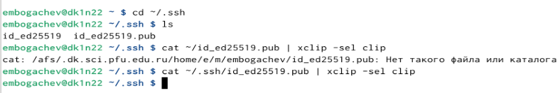

---
## Front matter
title: "Лабораторная работа №2"
subtitle: "Архитектура вычислительных систем"
author: "Богчев Егор Михайлович"

## Generic otions
lang: ru-RU
toc-title: "Содержание"

## Bibliography
bibliography: bib/cite.bib
csl: pandoc/csl/gost-r-7-0-5-2008-numeric.csl

## Pdf output format
toc: true # Table of contents
toc-depth: 2
lof: true # List of figures

fontsize: 12pt
linestretch: 1.5
papersize: a4
documentclass: scrreprt
## I18n polyglossia
polyglossia-lang:
  name: russian
  options:
	- spelling=modern
	- babelshorthands=true
polyglossia-otherlangs:
  name: english
## I18n babel
babel-lang: russian
babel-otherlangs: english
## Fonts
mainfont: PT Serif
romanfont: PT Serif
sansfont: PT Sans
monofont: PT Mono
mainfontoptions: Ligatures=TeX
romanfontoptions: Ligatures=TeX
sansfontoptions: Ligatures=TeX,Scale=MatchLowercase
monofontoptions: Scale=MatchLowercase,Scale=0.9
## Biblatex
biblatex: true
biblio-style: "gost-numeric"
biblatexoptions:
  - parentracker=true
  - backend=biber
  - hyperref=auto
  - language=auto
  - autolang=other*
  - citestyle=gost-numeric
## Pandoc-crossref LaTeX customization
figureTitle: "Рис."
tableTitle: "Таблица"
listingTitle: "Листинг"
lofTitle: "Список иллюстраций"
lolTitle: "Листинги"
## Misc options
indent: true
header-includes:
  - \usepackage{indentfirst}
  - \usepackage{float} # keep figures where there are in the text
  - \floatplacement{figure}{H} # keep figures where there are in the text
---

# Цель работы
Изучение идеологии системы контроля версий git и их применение.
Приобретение практических навыков по работе с системой git: создание учётной записи, SSH ключа, рабочего пространства и репозитория курса на основе шаблона и настройка каталога.

# Задание

1. Создайте отчет по выполнению лабораторной работы в соответствующем
каталоге рабочего пространства (labs>lab03>report).
2. Скопируйте отчеты по выполнению предыдущих лабораторных работ в
соответствующие каталоги созданного рабочего пространства.
3. Загрузите файлы на github.

# Выполнение лабораторной работы

Описываются проведённые действия, в качестве иллюстрации даётся ссылка на иллюстрацию 

1. Для выполнения работы используем https://github.com/ и создаём учётную запись, заполняя основные данные.:

{ #fig:001 width=90% }

2. Сначала сделаем предварительную конфигурацию git (совокупность настроек программы, задаваемая пользователем, а также процесс изменения этих настроек в соответствии с нуждами пользователя).
Открываем терминал и вводим следующие команды, указав своё имя и email:

{ #fig:002 width=90% }

3. Настроим utf-8 в выводе сообщений git (чтобы русские символы были читаемы, необходимо изменить параметр quotepath в секции [core], установив его в false):

{ #fig:003 width=90% }

4. Для последующей идентификации пользователя на сервере репозиториев
сгенерируем пару ключей(приватный и открытый)

{ #fig:004 width=90% }

5. Далее загрузим сгенерированный открытый ключ на Github, предварительно скопировав его в буфер обмена(рис. 3.5, рис. 3.6).

{ #fig:005 width=90% }

6. 

{ #fig:006 width=90% }

7. Создадим каталог для предмета «Архитектура последующего создания рабочего пространства компьютера» для

{ #fig:007 width=90% }

8. Через web-интерфейс github создадим репозиторий на основе шаблона,указав имя study_2024–2025_arh-рс

{ #fig:008 width=90% }

9. 

{ #fig:009 width=90% }

10. Перейдем в каталог курса и скопируем в него созданный репозиторий с помощью ссылки для клонирования

{ #fig:010 width=90% }

11. Перейдём в каталог курса, удалим лишние файлы, создадим нужные каталоги и загрузим файлы на сервер (рис. 3.11, 3.12, 3.13.1, 3.13.2).

{ #fig:011 width=90% }

12. 

{ #fig:012 width=90% }

13. 

{ #fig:014 width=90% }

13. 

{ #fig:015 width=90% }

14. Проверим правильность введённых команд

{ #fig:016 width=90% }

15. Приступим к выполнению заданий для самостоятельной работы.
Скопируем отчёты по выполнению прошлых лабораторных работ и переместим
отчет по выполнению данной лабораторной работы в соответствующих
каталогах рабочего пространства(рис. 3.15, 3.16).

{ #fig:017 width=90% }

16. 

{ #fig:018 width=90% }

17. Загрузим файлы на сервер(рис. 3.17, 3.18.1, 3.18.1).

{ #fig:019 width=90% }

18. 

{ #fig:021 width=90% }

18. 2

{ #fig:021 width=90% }

4 Выводы
В ходе выполнения этой я исследовал концепции и познакомился с
использованием систем контроля версий, а также приобрёл практические
навыки работы с git.

